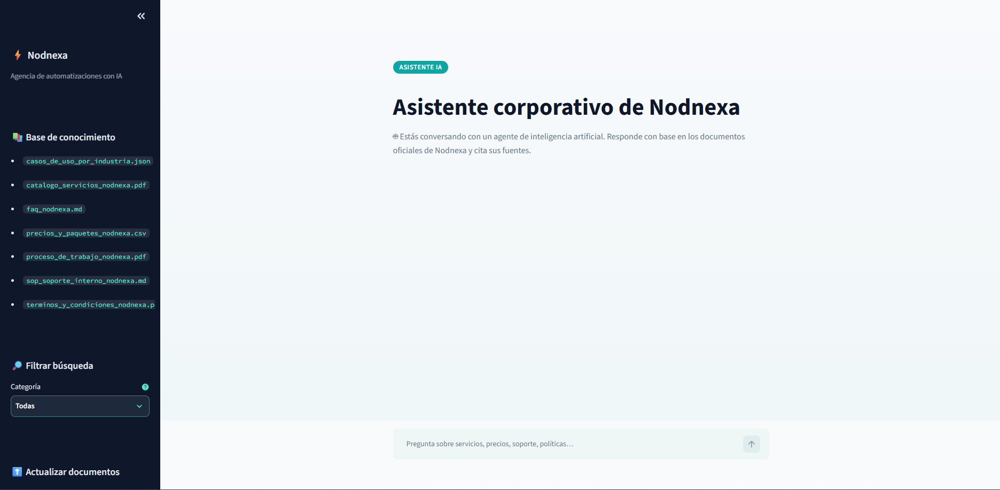
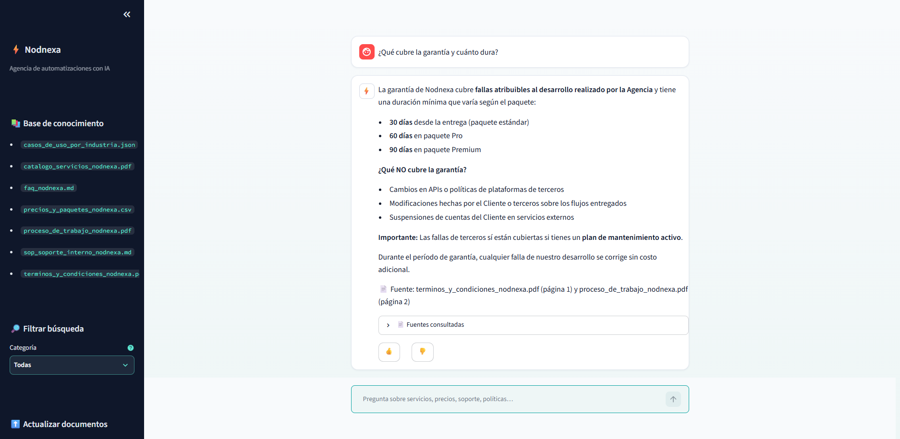

# ⚡ Nodnexa — Agente de Conocimiento Corporativo con IA


> **Challenge Alura Agente** · ONE (Oracle Next Education) · IA for Tech
> 🌐 **Demo en vivo (OCI):** https://demo.nodnexa.com

**Nodnexa** es una agencia de automatizaciones con IA para pymes de Latinoamérica. Este proyecto es su **agente de conocimiento corporativo**: un asistente conversacional que responde preguntas en lenguaje natural sobre la documentación interna de la empresa —servicios, precios, procesos, políticas, soporte— **citando siempre la fuente** (archivo, página, sección o fila) y **admitiendo explícitamente cuando la información no está en los documentos**, en lugar de inventarla.

## 🎬 El agente funcionando en Oracle Cloud

Desplegado en una VM Always Free de **Oracle Cloud Infrastructure** (servicios usados: **OCI Compute** + **OCI VCN**), con dominio propio y HTTPS (Caddy + Let's Encrypt): **https://demo.nodnexa.com**





*El agente en producción (https://demo.nodnexa.com): base de conocimiento multiformato, filtro por categoría, y respuestas que citan documento y página exactos.*

## 🏗️ Arquitectura

```
                        INGESTA (offline / al subir documentos)
┌──────────────────┐   ┌─────────────┐   ┌──────────────┐   ┌─────────────┐
│ Documentos        │ → │ Extracción  │ → │ Chunking     │ → │ Embeddings  │
│ PDF·CSV·MD·JSON   │   │ + limpieza  │   │ 1000 chars   │   │ Voyage AI   │
│ (7 docs, 4 fmtos) │   │ por formato │   │ overlap 150  │   │             │
└──────────────────┘   └─────────────┘   └──────────────┘   └──────┬──────┘
                                                                    ↓
                                                            ┌──────────────┐
                                                            │  ChromaDB    │
                                                            │ (persistente)│
                                                            └──────┬───────┘
                        CONSULTA (online)                          │
┌──────────┐   ┌───────────────────┐   ┌──────────────────┐       │
│ Pregunta │ → │ Búsqueda semántica│ ← ┤ Umbral relevancia├───────┘
│ (chat)   │   │ (mismo embedding) │   │ ≥ 0.35 (fallback)│
└──────────┘   └────────┬──────────┘   └──────────────────┘
                        ↓
               ┌─────────────────┐   ┌──────────────────────────┐
               │ Contexto + refs │ → │ Claude (Anthropic)       │
               │ de origen       │   │ responde SOLO del contexto│
               └─────────────────┘   │ + cita fuentes           │
                                     └────────────┬─────────────┘
                                                  ↓
                              ┌──────────────────────────────────┐
                              │ UI Streamlit: chat, fuentes,     │
                              │ feedback 👍👎, carga de documentos│
                              │ + logs JSONL de cada consulta    │
                              └──────────────────────────────────┘
```

**Decisiones clave de diseño:**

- **Extracción por formato:** cada tipo de documento se procesa según su naturaleza — PDF por página (para citar "página N"), CSV fila→frase con encabezados (las tablas pierden sentido como texto corrido), Markdown por sección, JSON por entidad de negocio.
- **Metadatos por chunk:** archivo, categoría de negocio (Comercial/Legal/Operacional/Interno...), y ubicación exacta — es lo que permite citar fuentes y filtrar búsquedas.
- **Anti-alucinación en dos capas:** (1) umbral de relevancia en la recuperación — si ningún fragmento supera 0.35 de similitud, el agente ni siquiera llama al LLM y responde "no encontré esta información"; (2) prompt que restringe a Claude a responder únicamente con el contexto recuperado.
- **Indexación incremental:** al subir un documento desde la interfaz solo se indexan sus chunks (reemplazando los previos del mismo archivo, sin duplicar) — no se reconstruye la base completa.

## 🛠️ Tecnologías

| Componente | Tecnología |
|---|---|
| Lenguaje | Python 3.12 |
| Orquestación RAG | LangChain |
| LLM (generación) | Claude — Anthropic API |
| Embeddings | Voyage AI (`voyage-3.5-lite`) |
| Base vectorial | ChromaDB (persistente) |
| Interfaz | Streamlit |
| Contenedores | Docker |
| Nube | **OCI Compute** (VM Always Free) + **OCI VCN** |

## 💬 Ejemplos de preguntas y respuestas

**Pregunta comercial:** *"¿Cuánto cuesta un chatbot de WhatsApp y qué incluye?"*
> **Precio:** Desde USD 1,000. **Incluye:** Agente IA en WhatsApp Business API, escalamiento automático a un humano, panel de conversaciones, 30 días de garantía. **Plazo:** 2-3 semanas.
> 📄 Fuente: precios_y_paquetes_nodnexa.csv (fila 6) y catalogo_servicios_nodnexa.pdf (página 1)

**Pregunta legal:** *"¿Qué cubre la garantía y cuánto dura?"*
> Mínimo 30 días desde la entrega (60 en paquete Pro, 90 en Premium). Cubre fallas atribuibles al desarrollo de Nodnexa. No cubre: cambios en APIs de terceros, modificaciones del cliente, suspensiones de cuentas externas...
> 📄 Fuente: terminos_y_condiciones_nodnexa.pdf (página 1, sección 4)

**Pregunta interna (colaboradores):** *"¿Qué hago si un cliente reporta el mismo fallo 3 veces en un mes?"*
> Se agenda una revisión integral del proyecto sin costo (auditoría interna de calidad), según el protocolo de escalamiento.
> 📄 Fuente: sop_soporte_interno_nodnexa.md (sección '4. Escalamiento')

**Pregunta sin respuesta en los documentos (fallback honesto):** *"¿Cuál es el horario de la oficina de Quito?"*
> No encontré esta información en los documentos disponibles de Nodnexa. Te sugiero escribir a hola@nodnexa.com [...] Lo que sí puedo confirmar es que el horario de atención de soporte es lunes a viernes, 9:00–18:00 (GMT-5).
> 📄 Fuente: sop_soporte_interno_nodnexa.md (sección '1. Canales y horarios')

## 📁 Estructura del repositorio

```
├── data/documents/       # Base de conocimiento (7 documentos: PDF, CSV, MD, JSON)
├── docs/                 # Guía de deploy en OCI + evidencias
├── src/
│   ├── config.py         # Configuración central (modelos, chunking, categorías)
│   ├── ingestion/        # Extracción por formato, chunking, indexación vectorial
│   ├── rag/              # Recuperación, agente, chat CLI, logging JSONL
│   └── ui/               # Interfaz de chat (Streamlit)
├── tests/                # Pruebas del pipeline de ingesta
├── Dockerfile            # Imagen de producción (ingesta automática al arrancar)
└── requirements.txt
```

## ⚙️ Cómo ejecutar el proyecto

### Requisitos previos

- Python 3.12+ (o Docker)
- API key de [Anthropic](https://console.anthropic.com) (LLM) y de [Voyage AI](https://dash.voyageai.com) (embeddings, tiene capa gratuita)

### Opción A — Local

```bash
git clone https://github.com/AndresS-max/nodnexa-agent.git
cd nodnexa-agent
python -m venv .venv
.venv\Scripts\activate            # Windows  (Linux/Mac: source .venv/bin/activate)
pip install -r requirements.txt

copy .env.example .env             # y completa tus dos API keys

python -m src.ingestion.run_ingestion    # construye el índice vectorial
streamlit run src/ui/app.py              # abre http://localhost:8501
```

También hay un chat por terminal: `python -m src.rag.cli`

### Opción B — Docker

```bash
docker build -t nodnexa-agent .
docker run -d -p 8501:8501 --env-file .env \
  -v nodnexa_vectorstore:/app/data/vectorstore \
  -v nodnexa_logs:/app/logs \
  nodnexa-agent
```

El primer arranque construye el índice automáticamente.

### Deploy en OCI

La guía completa paso a paso (VM Always Free, red, firewall, solución de problemas) está en **[docs/deploy_oci.md](docs/deploy_oci.md)**.

## 📝 Registro de ejecución

Cada consulta se registra en `logs/consultas.jsonl` (pregunta, respuesta, fuentes usadas, si se usó RAG, duración, timestamp) y el feedback 👍👎 en `logs/feedback.jsonl` — trazabilidad completa para auditar respuestas y detectar vacíos en la base de conocimiento.

## 🧪 Pruebas

```bash
python -m pytest tests/ -v
```

---

📌 Proyecto desarrollado para el **Challenge Alura Agente** del programa **ONE — Oracle Next Education** (Alura Latam + Oracle) · Julio 2026
